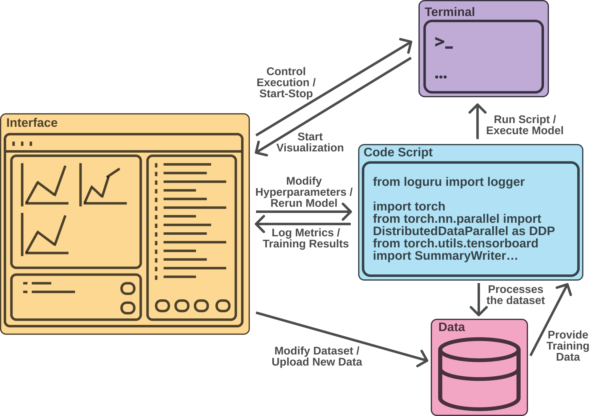
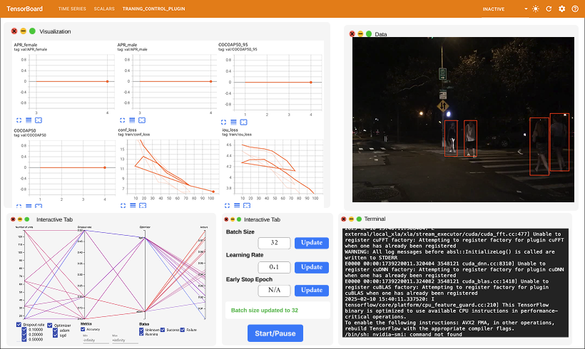
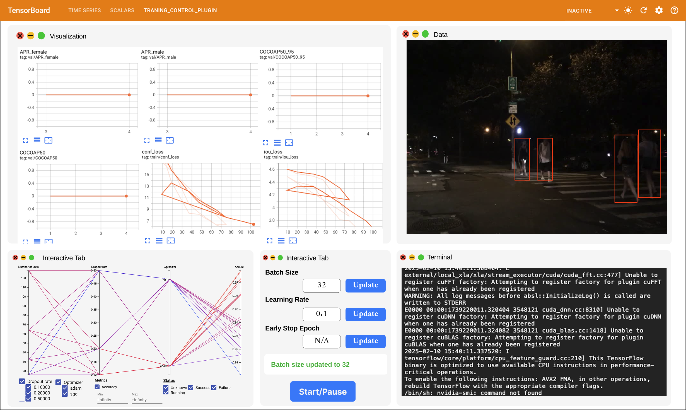
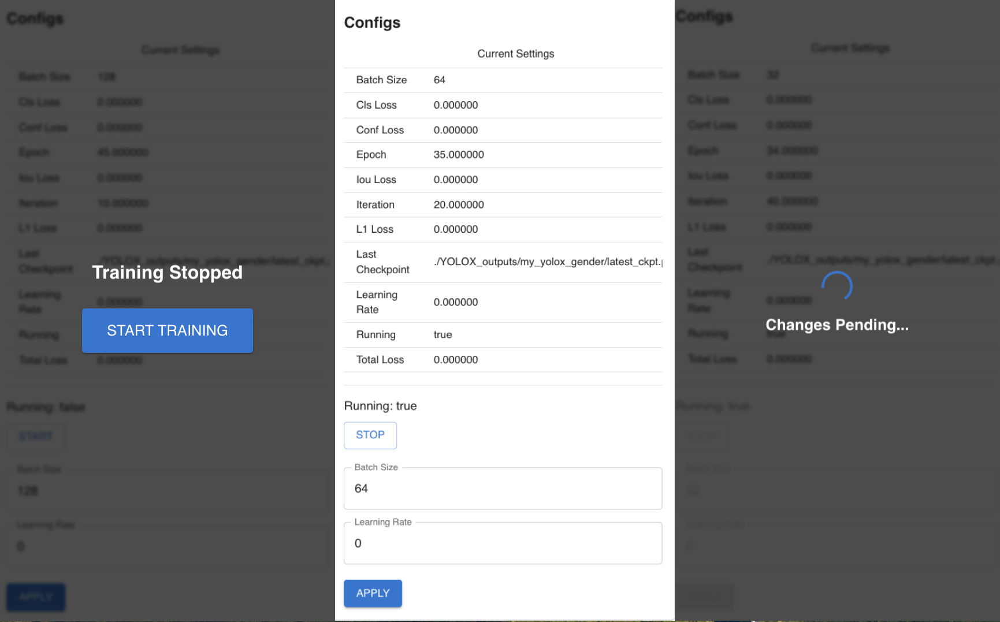

# FAI Interactive PlugIn
## Introduction
The TensorBoard Plugin in YOLOX(current) for metrics monitoring and interactive learning. (Updated later on the codes)

In modern machine learning, interactive learning with multiple fairness metrics can significantly benefit both researchers and industry professionals in developing more equitable classifiers and models. By providing real-time insights and visualizations, such tools enable users to monitor fairness-related disparities during training, facilitating more informed decision-making. This project introduces a TensorBoard plugin designed to visualize fairness in ML models, starting with YOLOX and extending to broader applications. By integrating fairness metrics into the training workflow, this tool empowers users to identify and mitigate biases, ultimately fostering the development of fairer AI systems.

#### YOLOX
YOLOX is an anchor-free version of YOLO, with a simpler design (but better performance)! It aims to bridge the gap between research and industrial communities.

## TB Plugin
The articatture of our plugin.


This project integrates a **TensorBoard plugin** for visualizing fairness in machine learning models. The system consists of four key components:

#### **1. Interface (Visualization Panel)**
- A graphical user interface (GUI) that displays real-time metrics, logs, and fairness visualizations.
- Provides interactive plots and structured logs to track model behavior.

#### **2. Terminal**
- The command-line interface (CLI) used to run scripts, execute commands, and manage processes.

#### **3. Code Script (ML Model & Logging)**
- The core script that handles model training, logging, and monitoring fairness.

#### **4. Data**
- The dataset used for model training and evaluation.
- Structured storage that feeds into the ML pipeline.

### **How It Works**
1. The **code script** executes model training, logs outputs, and tracks fairness-related metrics.
2. The **terminal** is used to launch, monitor, and manage the process.
3. The **interface** visualizes key metrics, enhancing interpretability and fairness tracking.
4. The **data storage** provides training and evaluation datasets.

This TensorBoard plugin is designed to ensure **transparency, interpretability, and fairness** in machine learning workflows.

Below shows a prospective finished overlook of our plugin.




Below shows a current finished overlook of our plugin.



## Quick Start

It have many aspect, like Visualization, Data/Token showing, HyperParameter Tuning, Basic interactive tab(Batch, LR, Pause, etc), Terminal tabs.

Note: the data/token may show only just few raondomly insetad of all the tokens.

### Start with TB Plugin

<details>
<summary>How to activate Plugin</summary>
You need three terminal to get our Plugin for now. One for the backend, one for the frontend, and last one for running script.

In 1st terminal(backend),
```shell
cd /home/chenz1/toorange/TBtest/YOLOX/fairness_panel
bash start_panel_backend.sh
```

In 2nf terminal(frontend),
```shell
cd /home/chenz1/toorange/TBtest/YOLOX/fairness_panel
bash start_panel_frontend.sh
```

In 3rd terminal(training),
```shell
cd /home/chenz1/toorange/TBtest/YOLOX/fairness_panel
bash start_training_controller.sh
```

Then go to localhost:5173. You can use the Plugin.
</details>


<details>
<summary>How to interactive with Plugin (now)</summary>


Currently, you can change "Batch Size", "Learning Rate" and "Stop/Start". Each time you change the Batch and LR, you should press "apply" to made work.(noticed it will be applied in next epoch)

All realted information of the training process are also shown on this part.
</details>

<details>
<summary>Ways to connected to Hipergator Node</summary>

We recomand to use the A100 instead of other GPU, which may causeing error related to no sufficient memory.

```shell
module load mamba
module load cuda
mamba activate datacheck
srun -p gpu --nodes=1 --gpus=a100:1 --time=01:30:00 --ntasks=1 --cpus-per-task=8 --mem 32gb  --pty -u bash -i
tensorboard --logdir=/home/user/toorange/YOLOX/YOLOX_outputs/my_yolox_gender/tensorboard --port=6006 --bind_all
```

Then copy over the hostname, for example c0907a-s29.ufhpc:6006

Then from the laptop (macbook), open another terminal (not from VSCODE!), run:
```shell
ssh -N -L 6007:c0907a-s29.ufhpc:6006 chenz1@hpg.rc.ufl.edu
```

After authentication, go to http://localhost:6007 on chrome.

</details>


### Start with YOLOX
<details>
<summary>Installation</summary>

Step1. Install YOLOX from source.
```shell
git clone git@github.com:Megvii-BaseDetection/YOLOX.git
cd YOLOX
pip3 install -v -e .  # or  python3 setup.py develop
```

</details>

<details>
<summary>Demo</summary>

Step1. Download a pretrained model from the benchmark table.

Step2. Use either -n or -f to specify your detector's config. For example:

```shell
python tools/demo.py image -n yolox-s -c /path/to/your/yolox_s.pth --path assets/dog.jpg --conf 0.25 --nms 0.45 --tsize 640 --save_result --device [cpu/gpu]
```
or
```shell
python tools/demo.py image -f exps/default/yolox_s.py -c /path/to/your/yolox_s.pth --path assets/dog.jpg --conf 0.25 --nms 0.45 --tsize 640 --save_result --device [cpu/gpu]
```
Demo for video:
```shell
python tools/demo.py video -n yolox-s -c /path/to/your/yolox_s.pth --path /path/to/your/video --conf 0.25 --nms 0.45 --tsize 640 --save_result --device [cpu/gpu]
```


</details>

<details>
<summary>Reproduce our results on COCO</summary>

Step1. Prepare COCO dataset
```shell
cd <YOLOX_HOME>
ln -s /path/to/your/COCO ./datasets/COCO
```

Step2. Reproduce our results on COCO by specifying -n:

```shell
python -m yolox.tools.train -n yolox-s -d 8 -b 64 --fp16 -o [--cache]
                               yolox-m
                               yolox-l
                               yolox-x
```
* -d: number of gpu devices
* -b: total batch size, the recommended number for -b is num-gpu * 8
* --fp16: mixed precision training
* --cache: caching imgs into RAM to accelarate training, which need large system RAM.


When using -f, the above commands are equivalent to:
```shell
python -m yolox.tools.train -f exps/default/yolox_s.py -d 8 -b 64 --fp16 -o [--cache]
                               exps/default/yolox_m.py
                               exps/default/yolox_l.py
                               exps/default/yolox_x.py
```

**Multi Machine Training**

We also support multi-nodes training. Just add the following args:
* --num\_machines: num of your total training nodes
* --machine\_rank: specify the rank of each node

Suppose you want to train YOLOX on 2 machines, and your master machines's IP is 123.123.123.123, use port 12312 and TCP.

On master machine, run
```shell
python tools/train.py -n yolox-s -b 128 --dist-url tcp://123.123.123.123:12312 --num_machines 2 --machine_rank 0
```
On the second machine, run
```shell
python tools/train.py -n yolox-s -b 128 --dist-url tcp://123.123.123.123:12312 --num_machines 2 --machine_rank 1
```

**Logging to Weights & Biases**

To log metrics, predictions and model checkpoints to [W&B](https://docs.wandb.ai/guides/integrations/other/yolox) use the command line argument `--logger wandb` and use the prefix "wandb-" to specify arguments for initializing the wandb run.

```shell
python tools/train.py -n yolox-s -d 8 -b 64 --fp16 -o [--cache] --logger wandb wandb-project <project name>
                         yolox-m
                         yolox-l
                         yolox-x
```

An example wandb dashboard is available [here](https://wandb.ai/manan-goel/yolox-nano/runs/3pzfeom0)

**Others**

See more information with the following command:
```shell
python -m yolox.tools.train --help
```

</details>


<details>
<summary>Evaluation</summary>

We support batch testing for fast evaluation:

```shell
python -m yolox.tools.eval -n  yolox-s -c yolox_s.pth -b 64 -d 8 --conf 0.001 [--fp16] [--fuse]
                               yolox-m
                               yolox-l
                               yolox-x
```
* --fuse: fuse conv and bn
* -d: number of GPUs used for evaluation. DEFAULT: All GPUs available will be used.
* -b: total batch size across on all GPUs

To reproduce speed test, we use the following command:
```shell
python -m yolox.tools.eval -n  yolox-s -c yolox_s.pth -b 1 -d 1 --conf 0.001 --fp16 --fuse
                               yolox-m
                               yolox-l
                               yolox-x
```

</details>


<details>
<summary>Tutorials</summary>

*  [Training on custom data](docs/train_custom_data.md)
*  [Caching for custom data](docs/cache.md)
*  [Manipulating training image size](docs/manipulate_training_image_size.md)
*  [Assignment visualization](docs/assignment_visualization.md)
*  [Freezing model](docs/freeze_module.md)

</details>

